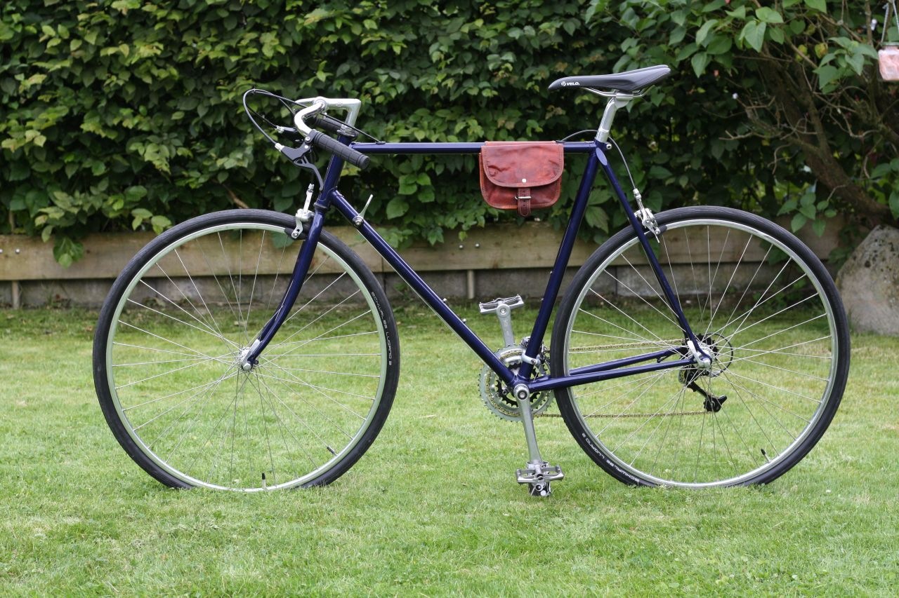
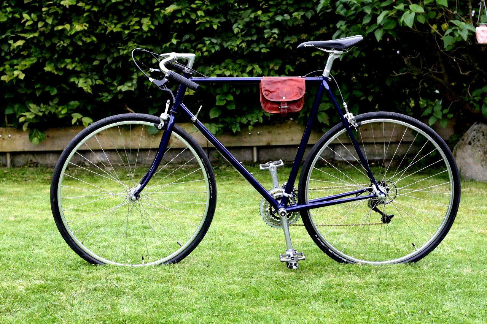

# yellow-ImageFilter
»ImageFilter« is an Datenstrom Yellow extension for applying image filters with [GD and Image Functions](https://www.php.net/manual/de/ref.image.php).

## Filter
This extension contains two filters: sharpen and contrast. If you want to use other filters or create your own filters, it is best to install the ImageFilterCollection extension. 

## Installation
[Download extension](https://github.com/PetersOtto/yellow-ImageFilter/archive/refs/heads/main.zip) and copy zip file into your `system/extensions` folder. Right click if you use Safari.

## How to use
1) You select the filter as a class with the identifier `imfi-`. For example: `[image 01-vintage-rennrad.jpg "alt text" "imfi-contrast"]`.
2) Use only one filter per img tag.
3) A filter can be set for all images in `system/extensions/yellow-system.ini` --> `imageFilterDefaultImfi`. If a filter is set for all images, the `imfi-original` class can be used to switch back to the original image.
4) If you want to switch off the title tag for all images, change in `system/extensions/yellow-system.ini` the setting of `ImageFilterUseTitleTag` from `1` to `0`.
5) If you want to switch off the webp support, change in `system/extensions/yellow-system.ini` the setting of `imageFilterUseWebp` from `1` to `0`.
6) With `imageFilterImageWebpQuality` and `imageFilterImageJpegQuality` in `system/extensions/yellow-system.ini` you can influence the quality of the images. Remember, the images are already compressed by the image extension when they are uploaded.
7) `.jpg`, `.jpeg` and `.png` formats are supported. Gifs are not supported.
8) If webp support is enabled and `imfi-original` is selected as the default filter, the webp version of the image will be used. If `imfi-original` is used as css class, the original version of the image is used.
9) If you want to use other filters or create your own filters, it is best to install the ImageFilterCollection extension.

## Examples

|  -  | - | - |
| --- | --- | --- |
| 

 | 

 | 
sharpen filter
 | 
| 

 | 

 | 
contrast filter
 |

## Developer
PetersOtto. [Get help](https://datenstrom.se/yellow/help/)

Thx to: 
* [@GiovanniSalmeri](https://github.com/GiovanniSalmeri), for helping me with your `php` skills.
* [@pftnhr](https://github.com/pftnhr), for the [yellow-absoluteimage](https://github.com/pftnhr/yellow-absoluteimage) extension. The code of this extension gave me the decisive idea.
* [@datenstrom](https://github.com/datenstrom), for developing Yellow &#128512;
